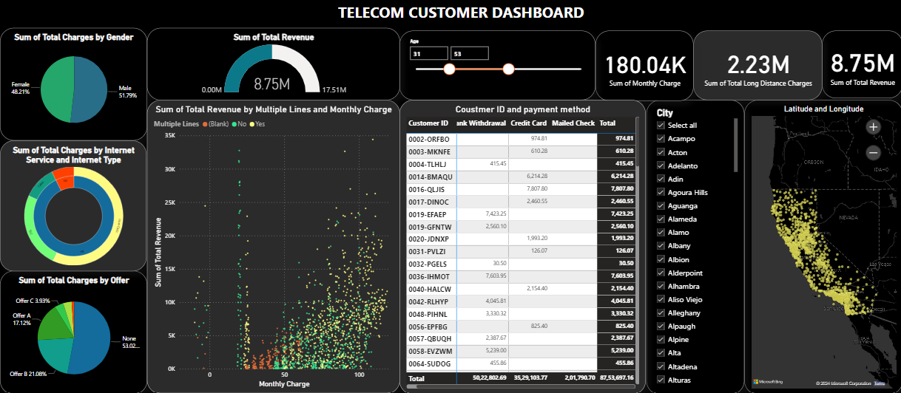

# Telecom Data Analysis Tableau Dashboard

## Overview

This repository features a sophisticated Tableau dashboard for telecom data, leveraging advanced analytics for in-depth trend analysis. The goal is to enhance data understanding and streamline insights communication, offering a visually compelling interface for users to extract meaningful conclusions from the dataset.

## Dataset

The dataset contains 33 variables, including Customer, Gender, Age, Married, Number of Dependents, City, Zip Code, Latitude, Longitude, Number of referrals, Tenure in Months, Offer, Phone Service, Avg Monthly GB Download, Online Security, Online Backup, Device Protection Plan, Premium Tech Support, Streaming TV, Streaming Music, Unlimited Data, Contract, Paperless Billing, Payment Method, Monthly Charges, Total Charges, Total Refunds, Total Extra Data Charges, Total Long-Distance Charges, Total Revenue, Customer, Churn Category, Churn Reason.

Key points about the dataset:

- Data collection spans across different cities in the state of California.
- Three distinct Internet Types: Cable, DSL, and Fiber Optic.
- Various offers available: A, B, C, D, E, and none.

## Dashboard

The dashboard offers customization options tailored to specific cities in California and provides flexibility based on age preferences.

- Total Revenue summation.
- Total Charges summation by Gender.
- Total Charges summation by Internet Service and Type.
- Total Charges summation by Offer.
- Total Revenue summation by Multiple Lines and Monthly Charge.
- Monthly Charge and Total Revenue summation.
- Map displaying data collection locations in California cities.

## Conclusion

The dashboard reveals a male majority of 51.79%, with females accounting for 48.21%. The preferred Internet type is Fiber Optic. Interestingly, 53.02% of customers opt for no specific offer, followed by Offer B. A detailed table includes Customer IDs and their chosen payment methods. The cumulative Monthly Changes sum up to $180.05K, contributing to a Total Revenue of $8.75M.
